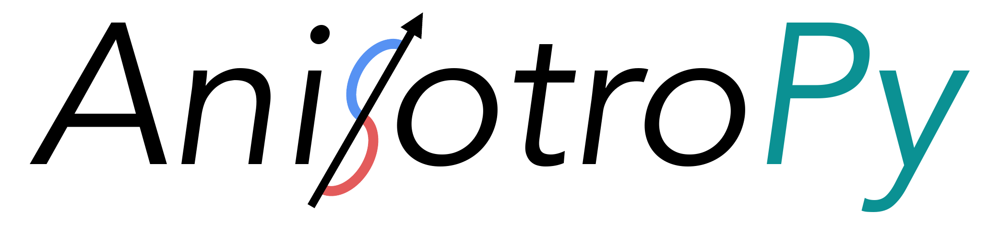

AnisotroPy is a Python package that provides standard routines for a number of aspects of the study of seismic anisotropy, including: shear-wave splitting analysis (to be implemented), effective media modelling, multiple layer fitting, and more.

The package has been built to provide an efficient pythonic implementation of a number of long-established methods that can be either incorporated into analysis scripts, or used with a high-level dashboard interface. Where possible, we aim to provide parsers for the outputs of a number of established packages for shear-wave splitting analysis. This will be accomplished in future via a sibling project, AnIO, which will establish a standard, unified file format for shear-wave splitting analyses.

Documentation
-------------
Documentation for AnisotroPy is hosted [here](https://seismicanisotropy.readthedocs.io/en/latest/index.html).

Installation
------------
Installation instructions can be found [here](https://seismicanisotropy.readthedocs.io/en/latest/installation.html).

Usage
-----
We are working on tutorials covering how each individual aspect of the package works, as well as example use cases where we provide substantive reasoning for the parameter choices used.

This is a work in progress - [see our documentation for full details](https://anisotropy.readthedocs.io/en/latest/tutorials.html).

For a more comprehensive demonstration of the options available, see the [template scripts](examples/template_scripts).

Citation
--------
If you use this package in your work, please cite the following:

AnisotroPy Developers (2022). AnisotroPy: v0.0.1 (v0.0.1). Zenodo. https://doi.org/10.5281/zenodo.5931586

Contact
-------
Any comments/questions can be directed to:
* **Conor Bacon** - cbacon [ at ] ldeo.columbia.edu

License
-------
This package is written and maintained by the AnisotroPy developers, Copyright AnisotroPy developers 2021--2022. It is distributed under the GPLv3 License. Please see the [LICENSE](LICENSE) file for a complete description of the rights and freedoms that this provides the user.
